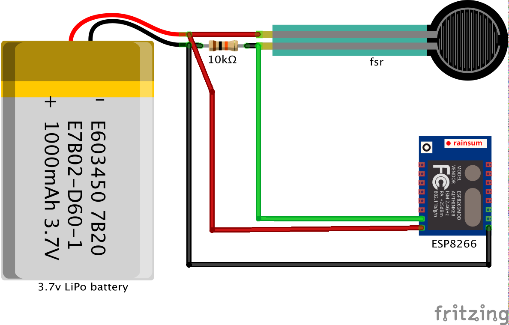

# Detech Pressuremeter

*Wristband device for inducing dermal ulcers using a blood pressure pump.*


The device induces dermal ulcers using a blood pressure pump and measures the applied force with a [Force Sensing Resistor](http://www.trossenrobotics.com/store/p/6445-5-Inch-Force-Sensing-Resistor-FSR.aspx). Data could be send to a Firebase backend through WiFi.

The purpose of this device is to create dermal ulcers in a very initial state, allowing us to take meaningful pictures and using them as input for our machine learning algorithms.     


## Connection Diagram




## Hardware components

- [D1 mini ESP8266 wifi board](https://wiki.wemos.cc/products:d1:d1_mini)
- [.5 Inch Force Sensing Resistor (FSR)](http://www.trossenrobotics.com/store/p/6445-5-Inch-Force-Sensing-Resistor-FSR.aspx)
- Blood pressure pump
- 3.7v Li-ion battery
- 10kΩ resistor


## Software

This project uses [PlatformIO](http://platformio.org/) as a multi-platform build system. The embedded platform for this project is `espressif8266`using an Arduino framework, as stated in the [platformio.ini](./UPPPv3/platformio.ini) configuration file.

```
[env:d1_mini]
platform = espressif8266
board = d1_mini
framework = arduino
```


## Installation

First, follow [PlatformIO IDE installation guide](http://platformio.org/platformio-ide) for Atom or VSCode.  
Then, follow PlatformIO [quick start guide](http://docs.platformio.org/en/latest/ide/atom.html#quick-start) for setting up, building, cleaning, and uploading the project.


## main.cpp

In the main loop we perform a calibration of the sensor reading. The calibration values were empirically estimated after many tests using the wristband device.

```cpp
void loop() {
    float rawPressure = constrain(990-analogRead(0), 0, 990);
    //0.00263233
    float realPressure = (0.00273233*rawPressure + 0.08200484)*735.5591210146755;
    //Firebase.setFloat("currentPressureValue", realPressure);
    Serial.println(rawPressure);   
	...
}
```


## License


## Authors